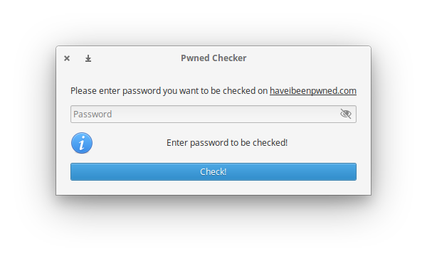

# Pwned Checker

Simple application for checking if a password is foud in [Pwned Passwords repository](https://haveibeenpwned.com/)

<div style="text-align:center">
    
</div>
## Building and Installation

You'll need the following dependencies:

```
libglib2.0-dev
libgranite-dev
libgtk-3-dev
meson
valac
```


Run `meson` to configure the build environment and then `ninja` to build

```
meson build --prefix=/usr
cd build
ninja
```

To install, use `ninja install`

```
sudo ninja install
```

